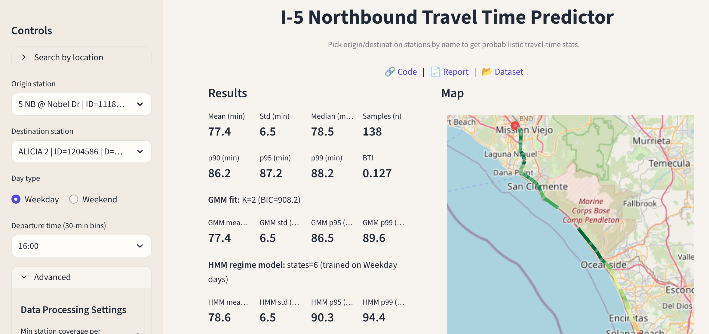

# traffic_viz

<p align="center">
  
</p>
<p align="center">
  
  
  
  
  
</p>

<p align="center">
  <strong>Interactive probabilistic travel-time analysis for the I-5 Northbound corridor</strong><br>
  Built on PeMS 5-minute station data
</p>
<p align="center">
<strong>External Links</strong> <br>
  <a href="https://trafficviz.streamlit.app/">Online Demo</a> •
  <a href="https://drive.google.com/file/d/1c1NcC8z1EK5XPaLwvYaR1JTWvFqHbAv1/view?usp=drive_link">Project Report</a> •
  <a href="https://youtu.be/zIdNeH_Uu90">Video Demo</a> 
</p>
<p align="center">
  <strong>README Navigation</strong><br>
  <a href="#-features">Features</a> •
  <a href="#-project-structure">Project Structure</a> •
  <a href="#-getting-started">Getting Started</a> •
  <a href="#-data-setup">Data Setup</a> •
  <a href="#-inference--visualization">Inference</a>
</p>

---

## 🚦 Overview

**traffic_viz** is an interactive system for **probabilistic corridor-level travel time estimation** on the I-5 Northbound corridor.  
It supports multiple statistical models, conditioning on temporal context, and provides both a **visual dashboard** and a **CLI-first workflow**.

The project is designed to be:
- **Data-driven**
- **Modular**
- **Transparent**
- **Easy to extend with new models or corridors**

---

## ✨ Features

- Flexible start/end specification (station IDs/names *or* general addresses)
- Corridor-level travel time estimation
- Time-of-day and weekday/weekend conditioning
- Probabilistic metrics:
  - Mean travel time
  - p95
  - Buffer Time Index (BTI)
  - Reliability
- Multiple estimation backends:
  - Empirical
  - Gaussian Mixture Models (GMM)
  - Hidden Markov Models (HMM)
- Interactive **map-based visualization**
  - Dynamic route coloring based on average speed
- **Streamlit dashboard** for exploration
- **CLI tools** for preprocessing, diagnostics, and automation
- Designed for **cloud deployment**

---

## 🗂 Project Structure

> The repository is organized to clearly separate raw data, cached artifacts, application logic, and tooling.

```bash
traffic_viz
├── data
│   ├── 5min_data  # ⬇️ Download required (raw PeMS data)
│   │   ├── d07_text_station_5min_2025_10_01.txt.gz
│   │   ├── d07_text_station_5min_2025_10_02.txt.gz
│   │   └── d12_text_station_5min_2025_10_31.txt.gz
│   ├── cache_parquet # Generated after preprocessing
│   │   ├── d07_text_station_5min_2025_10_01.parquet
│   │   ├── d07_text_station_5min_2025_10_03.parquet
│   │   └── d07_text_station_5min_2025_10_04.parquet
│   └── station_metadata  # Station ID ↔ name mapping
│       ├── d07_text_meta_2023_12_22.txt
│       ├── d11_text_meta_2022_03_16.txt
│       └── d12_text_meta_2023_12_05.txt
├── pyproject.toml
├── README.md
├── requirements.txt              # Mostly for cloud deployment
├── src
│   └── traffic_viz
│       ├── app.py                # Entry point (cloud / Streamlit)
│       ├── cli.py                # CLI entry point
│       ├── config.py             # Data path management
│       ├── __init__.py
│       ├── metadata_tmdd.py      # PeMS metadata cleanup
│       ├── preprocess_5min.py    # Raw PeMS preprocessing
│       └── travel_time.py        # Travel-time sample generation
└── tests
    ├── build_samples.py          # Legacy (to be removed)
    └── conditional_stats.py      # Legacy (to be removed)
```

## 🚀 Getting Started
### Environment Setup
> [!TIP]
> It is strongly recommended to run this project inside a virtual environment.

```bash
conda create -n traffic_viz python=3.10 -y
conda activate traffic_viz

# Clone the Git repo
git clone https://github.com/TextZip/traffic_viz

# Move into the root directory
cd traffic_viz

# Install deps
pip install -e .

```
### 📦 Data Setup
The project expects 5-minute PeMS station datasets in compressed (.txt.gz) format. 

> [!NOTE]
> The exact dataset used for development and testing is available here: [Drive Link](https://drive.google.com/drive/folders/1Ms151kBdxH-d284sY8oyMqVU61OwpqXG). 

**Steps**

1. Download the contents of:
```
GoogleDrive/data/5min_data
```
2. Move them into:
```
traffic_viz/data/5min_data
```

> [!IMPORTANT]
> Refer to the Project Structure section to ensure files are placed correctly.

> [!NOTE]
> Only `5min_data` must be downloaded.
> `station_metadata` and `cache_parquet` are already included in the repository. Copies in Google Drive are provided only for redundancy.

**Verify Data Setup**
Run diagnostics:
```bash
traffic_viz diagnostics
```
Expected output:
```bash
> traffic_viz diagnostics
[INFO] DATA_DIR = /home/jai/******/GitHub/traffic_viz/data
[INFO] station_metadata/: OK (/home/jai/******/GitHub/traffic_viz/data/station_metadata)
[INFO] 5min_data/:        OK (/home/jai/******/GitHub/traffic_viz/data/5min_data)
[INFO] cache_parquet/:    OK (/home/jai/******/GitHub/traffic_viz/data/cache_parquet)
```
> [!TIP]
> Use `traffic_viz --help` to explore all available CLI commands and options.


### 🛠 Pre-Processing 
> [!WARNING]
> You can skip this step if you are using the default dataset.  `cache_parquet` already comes with the default data pre-processed for your convenience.

Run this only when:
- Using new PeMS data
- Adding new dates or corridors
- Modifying preprocessing logic

```bash
# preprocess raw PeMS data (first time only and for custom or new data only)
traffic_viz preprocess --data-dir /path/to/data
```

### 📊 Inference & Visualization
Launch the interactive application:
```bash
traffic_viz app --data-dir /path/to/data
```
This starts:
- The Streamlit dashboard
- Interactive map-based visualization
- Probabilistic travel-time analysis interface

## 📌 Notes
- This project is under active development, expect breaking changes.
- Legacy test code will be removed or refactored